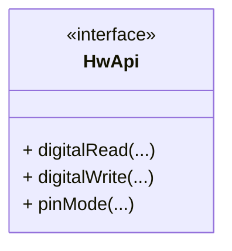
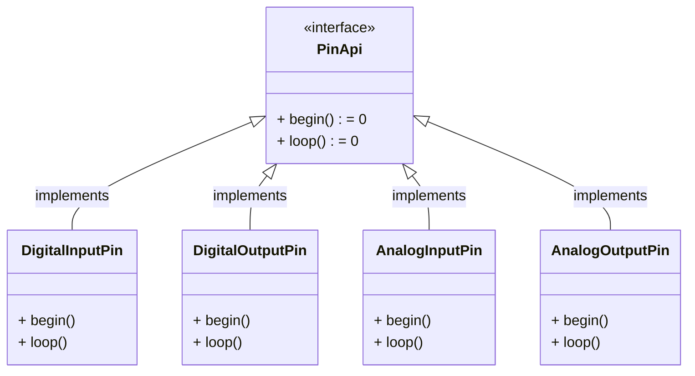
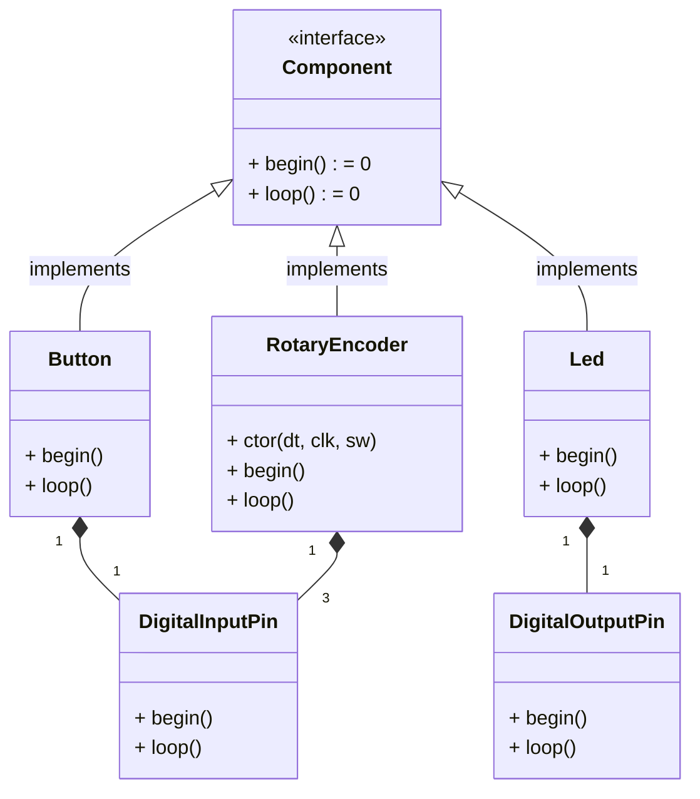
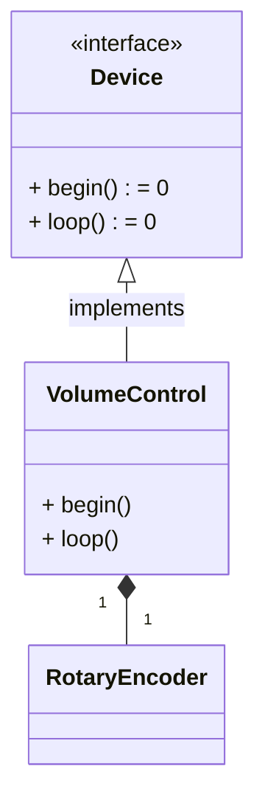

# Support Library for Arduino Devices

## Overview

This library is meant to provide different options to use Arduino or other compatible controllers and integrate use of
different devices (rotary encoders, buttons, switches).

## Abstraction Levels

There are following levels of abstractions:

  1. Raw API
  2. Support library hardware API facade
  3. Pins
  4. Components
  5. Devices

### Raw Arduino API

Direct usage of Arduino API functions like `pinMode()`, `digitalRead()` etc.

### Support library hardware API facade

This is a facade to isolate Arduino API calls.

It provides the possibility of mocking these interfaces for the purpose of components unit testing.

### Pins

Abstraction level that represents pins and work with them.

### Components

Component is a composition of pins that has clear real life functional representation:

  * encoder
  * switch
  * button
  * etc.

### Devices

Device is a composition of components providing a specific functionality to user (e.g. volume control, gamepad, 
mouse, etc.).

