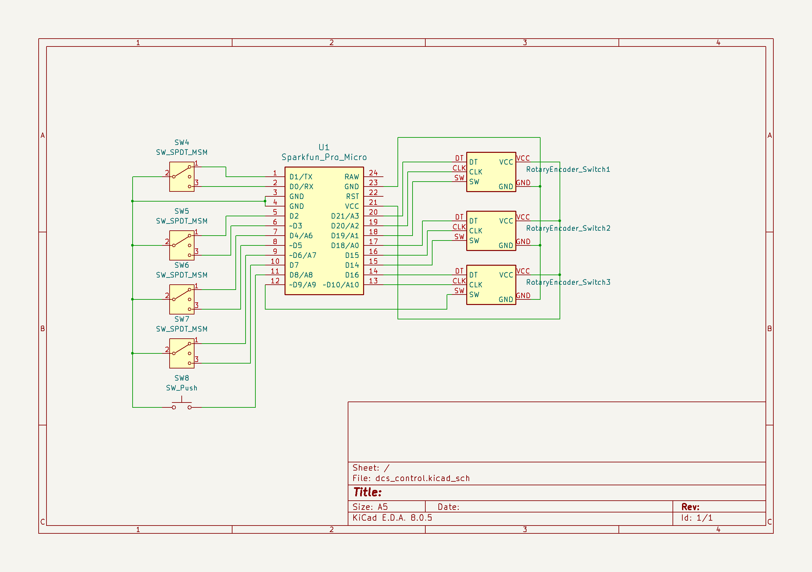
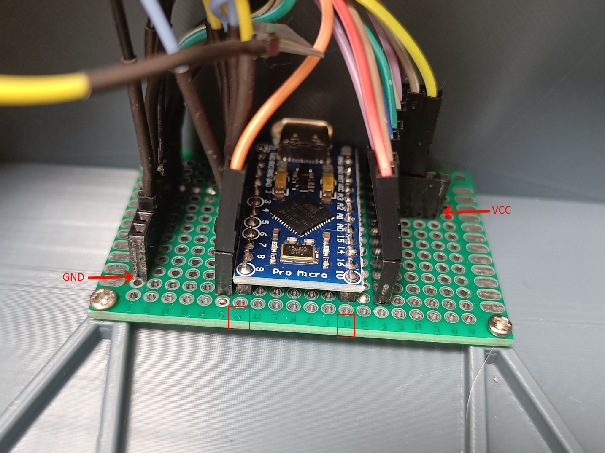
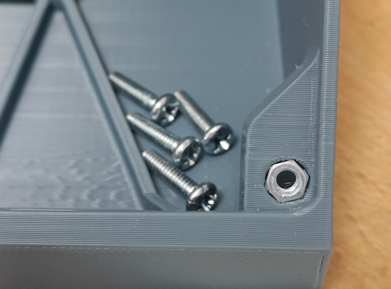
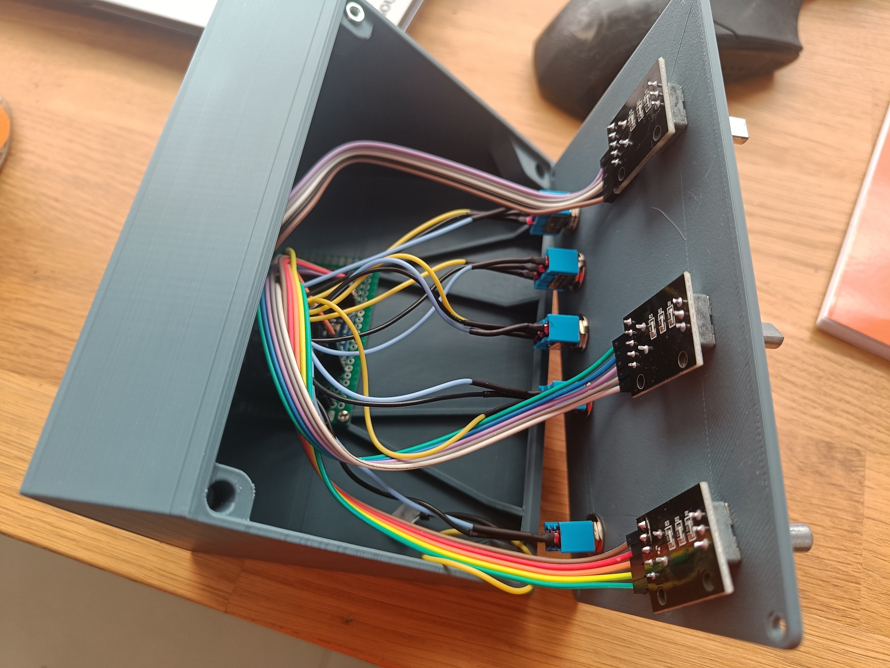

# Custom Flightsim Controller

## Overview

This is a controller based on Arduino Pro Micro that has the following controls:

* 3x [KY-40][1] rotary encoder
* 5x [MTS-103][2] switches (Pro Micro has only 18 available pins so one of switches has only one position)

The final result is:

## Schematics

## Kicad Project

All necessary files can be found in `kicad_schematics` directory.

It also includes the `Library.kicad_sym` file with all used symbols (including KY-40 thad I added).

Arduino Pro Micro symbol was taken from https://github.com/g200kg/kicad-lib-arduino.

## Arduino IDE setup

In order to compile the project you will need to copy `support_library` from the repository root to your `libraries`
directory setup in `Arduino IDE`.

## Enclosure

You can print the enclosure on your own using files from [Thingiverse][4] or from [Onshape][3].

Both parts can are designed to be printed without supports.

## Assembly

### Materials

* Arduino Pro Micro with USB Type-C connector
* 3x [KY-40][1] rotary encoders
* 5x [MTS-103][2] ON-OFF-ON switches
* 40x60 mm prototype board
* Dupont connectors
* Wires
* 4x screws and hex nuts for front board
* 2x small screws to fix the board inside enclosure

### Tools

* Soldering iron
* Screwdriver

### Board Soldering

Solder Pro Micro board to prototype board so contacts will be at the `H` and `N` lines.

Solder and connect dupont connectors.

### Enclosure Assembly

Put the hex nuts in to the holes in the enclosure. You may need to heat them using soldering iron to put in place.

### Connecting Wires

After you connect all wires to the board it should look like follows.

[1]: https://components101.com/modules/KY-04-rotary-encoder-pinout-features-datasheet-working-application-alternative
[2]: https://www.electronicoscaldas.com/datasheet/MTS-SMTS-Series.pdf
[3]: https://cad.onshape.com/documents/e425ee2340f5601c5e1a5aaf/v/4324a4a94ae8675d3ea1beb6/e/39858566a553c3aea85e9fa7?renderMode=0&uiState=67234d16d387c934eef4d566
[4]: https://www.thingiverse.com/thing:6815039

