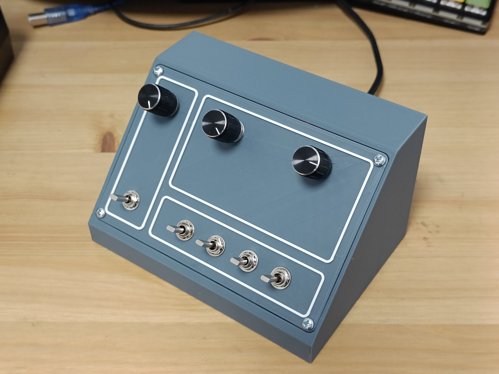

# Custom Flightsim Controller

## Overview

This is a controller based on Arduino Pro Micro that has the following controls:

* 3x [KY-40][1] rotary encoder
* 5x [MTS-103][2] switches (Pro Micro has only 18 pins to be used so one of switches has only one position)

Something like:

[1]: https://components101.com/modules/KY-04-rotary-encoder-pinout-features-datasheet-working-application-alternative
[2]: https://www.electronicoscaldas.com/datasheet/MTS-SMTS-Series.pdf

