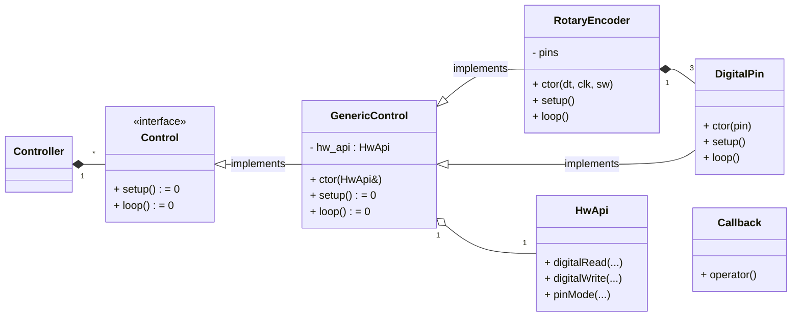

# Support Library for Arduino Devices

## Overview

This library is meant to provide different options to use Arduino and integrate use of different controls.

## HID Controller

The idea of the HidController is to provide the generic declarative API for simple HID devices.

