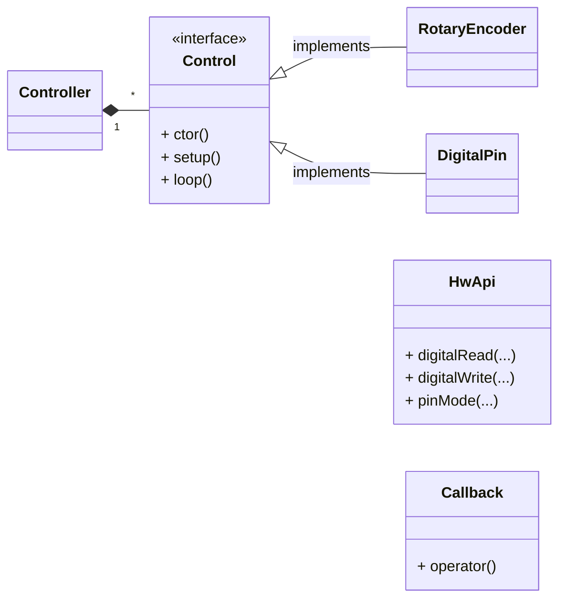

# Support Library for Arduino Devices

## Overview

This library is meant to provide different options to use Arduino and integrate use of different controls.

## Device Builder

```mermaid
classDiagram
    direction RL
    class Controller
    
    class Control {
        <<interface>>
        + ctor()
        + setup()
        + loop()
    }
    
    class RotaryEncoder
    class DigitalPin
    
    class HwApi {
        + digitalRead(...)
        + digitalWrite(...)
        + pinMode(...)
    }
    
    class Callback {
        + operator()
    }
    
    RotaryEncoder --|> Control : implements
    DigitalPin --|> Control : implements
    Control "*" --* "1" Controller
```