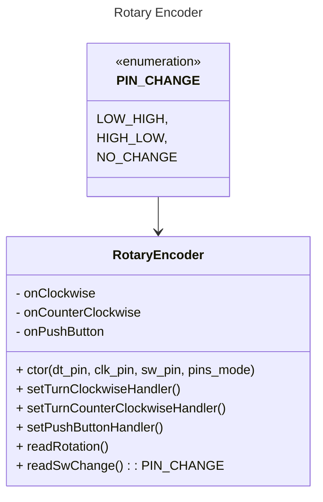

# Volume Control with PC Busy

## Idea

To build a device that will contain following functionalities:

  * Volume control (volume up, volume down, mute)
  * Mouse move emulator
  * Keyboard input emulator

## User Interface

  * 5-pin rotary encoder to control volume
  * button to turn on/off mouse move emulation (with status LED)
  * button to turn on/off keyboard input emulation (with status LED)

### Software Design

